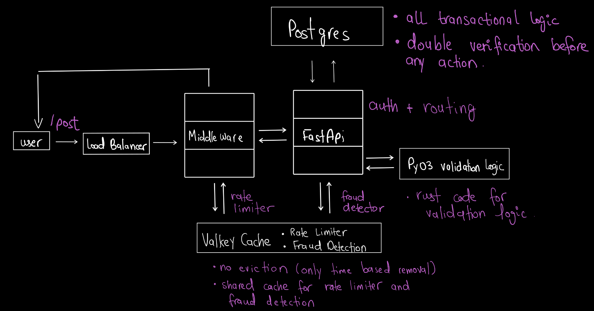

# Transactions/Actions/Loan Payments etc (Post Requests in General)

## Design Diagram:

### Load Balancer:
- Forwards Requests to FastAPI workers

### Middleware :
- Routes the request to the FastAPI workers after the rate limiter checks pass

### Valkey Cache:
- Combined non-eviction cache for Rate Limiter + Fraud Detection
- Note you can seggregate both, it depends on your needs.
 (P.S you can also use DynamoDB/FASTER/RocksDB) for fraud detectors too, if you need presistent storage for long term.
- You can also use DragonFly if you wish.

### PyO3 with Rust for logic:
- For high speed checks and concurrency.

### PostgreSQL
- PostgreSQL (most of the app logic lives within PostgreSQL, auth, role assignment, transactions etc, changing the database is not possible, unless you can re-write the PL/pgSQL code into PL/SQL.)
- I would not recommend changing the database either, Postgres is perfect for this.
